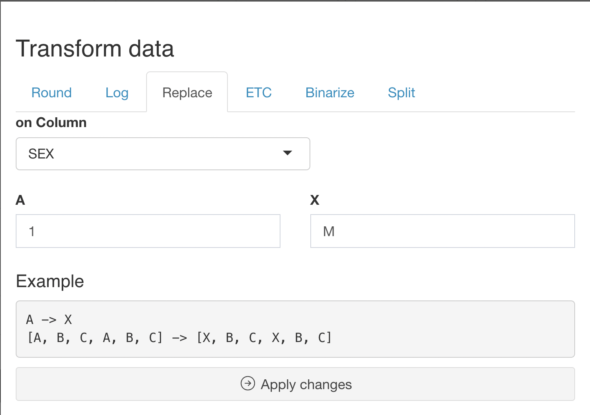
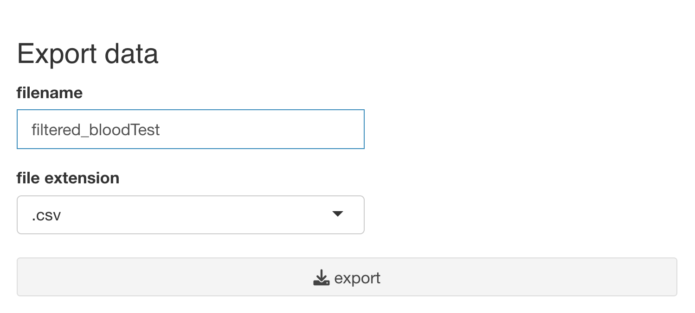
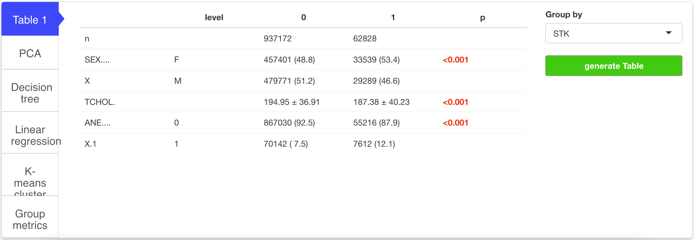
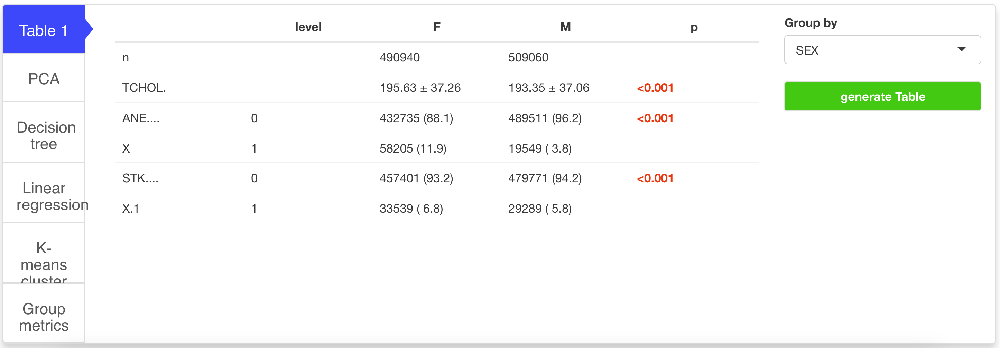

## Purpose

Datatoys 패키지의 bloodTest 데이터를 이용해서, "총 콜레스테롤 수치가 높은사람이 빈혈 및 뇌혈관질환을 진단받은 경우가 많은가? / 발생하는 정도가 성별별로 차이가 있는가" 라는 주제의 연구를 수행 해 보겠습니다.

본 문서에서는 ML은 다루지 않습니다.

## Data Loading and Modification

### Load Data

데이터를 불러옵니다. 원하는 데이터 업로드/선택 후 Import Data나 Load Example Data를 클릭하면 됩니다.

본 예제에서는 Datatoys 패키지의 bloodTest(1,000,000 x 9) 데이터를 사용 할 예정입니다.

데이터 로드 후 위 스크린샷과 같은 화면이 나오게 됩니다.

### Update Data

주제에 맞게, 필요한 데이터(SEX, TCHOL, ANE, STK)를 제외하고 체크를 해제합니다.

또 위 데이터 중, SEX, ANE, STK값이 Factor 이므로 해당 값을을 Factor로 변환해야 합니다.

하단의 Update Data를 클릭하고,

위와 같이, 각자의 데이터에 맞게 설정한 다음 하단의 Apply Changes 버튼을 클릭하면 데이터 형태가 변경됩니다.

참고로, Integer과 Numeric의 차이는 Integer은 정수만 표현할 수 있고, Numeric은 소숫점 표현이 가능하다는 것입니다.

### Transform Data

성별이 1, 2로 표기되어 있으므로 원활한 데이터 파악을 위해, Transform Data 의 Replace 기능을 통해 SEX column의 1을 M, 2를 F로 변경 해 줍니다.

### Export Data

가공한 데이터를 Export Data 기능으로 저장할 수 있습니다. 추후 동일한 데이터로 다시 작업할 때 사용 가능합니다.

## Visualization

간략한 데이터의 분포를 파악하기 위해, Statgarten에 포함된 Visualization 기능(colorpen 패키지)를 활용합니다.

데이터를 불러오면, 기본적으로 Vis 탭으로 이동되게 됩니다. 스크롤을 내려 X, Y에 원하는 값을 드래그합니다.

이 그래프는, 뇌혈관질환 여부에 따른 총 콜레스테롤을 Boxplot으로 나타낸 것이고,

이 그래프는 빈혈 여부에 따른 총 콜레스테롤을 Boxplot으로 나타낸 것입니다.

\<Vis 추가\>

그래프 상 큰 차이가 없는 것을 알았으니, 통계적으로도 그러한지 알아보겠습니다.

## EDA

EDA의 Variables탭에서는 존재하는 column에 대한 간단한 요약을 보실 수 있습니다.

빈혈과 뇌혈관질환 변수에서, 0(진단 받은 이력 없음)이 각 92.2%, 93.7%로, 1(진단 받은 이력 있음)이 각 7.8%, 6.3%임을 알 수 있습니다.

연속 변수는 분포 또한 볼 수 있는데, EDA의 Distribution 탭에서 연속 변수를 선택하면 위 그림과 같은 분석 결과가 나오는 것을 보실 수 있습니다.

빈혈 여부를 기준으로 Table 1를 구해 보았습니다. Table 1이란, 연구에서 주요 변수를 포함하는 전체 연구 표본에 대한 기술통계량을 나타낸 표입니다.

빈혈을 기준으로, 총 콜레스테롤의 p값이 0.05보다 작으므로, 빈혈 여부과 총 콜레스테롤 양은 관계가 있습니다.

뇌혈관질환 여부를 기준으로 Table 1를 구해 보았습니다.

뇌혈관질환 여부를 기준으로, 총 콜레스테롤의 p값이 0.05보다 작으므로, 뇌혈관질환 여부과 총 콜레스테롤 양은 관계가 있습니다.

다음으로, 성별에 따른 Table 1입니다.

남성과 여성의 빈혈, 뇌혈관질환 발생 정도가 유의미한 차이가 있음을 알 수 있습니다.

구체적으로, 빈혈과 뇌혈관질환 발생 정도 모두 여성에서 더 높았습니다.

## 결론
