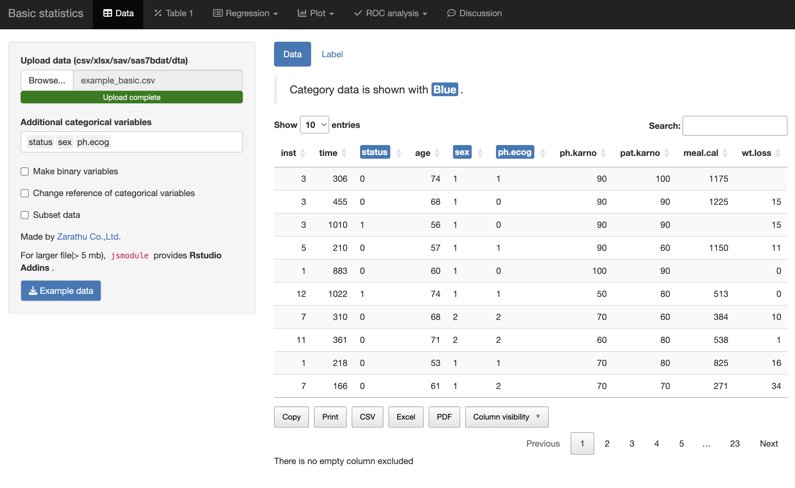

```{r, include = FALSE}
knitr::opts_chunk$set(
  collapse = TRUE,
  comment = "#>"
)
library(statgarten)
```

Survival data: <a href = 'https://raw.githubusercontent.com/statgarten/statgarten/main/data/example_basic.csv' target = '_blank'> New Link</a>

#### 다루는 내용

- Openstat 접속 및 데이터 업로드
- 데이터 매니지먼트
- Table 1 생성
- Logistic regression
- Plot
- ROC Plot 

### 1: Openstat 접속 및 데이터 설명

<!--
<p align='center'>
  
</p>
-->

<p align = 'center'>
  <iframe width="560" height="315" src="https://www.youtube.com/embed/_RR3Iug_2Ew?si=hinRpXSy4V2MLPDY" title="YouTube video player" frameborder="0" allow="accelerometer; autoplay; clipboard-write; encrypted-media; gyroscope; picture-in-picture; web-share" allowfullscreen></iframe>
</p>

### 2: Openstat "Data" 페이지

<p align = 'center'>
  <iframe width="560" height="315" src="https://www.youtube.com/embed/zzUoq_9wWwg?si=6hzYDEFGFIG68IIq" title="YouTube video player" frameborder="0" allow="accelerometer; autoplay; clipboard-write; encrypted-media; gyroscope; picture-in-picture; web-share" allowfullscreen></iframe>
</p>

### 3: Openstat "Table 1" 페이지 

<p align = 'center'>
  <iframe width="560" height="315" src="https://www.youtube.com/embed/wOSXjJUerJM?si=wm0n-jvlmoiQlOTy" title="YouTube video player" frameborder="0" allow="accelerometer; autoplay; clipboard-write; encrypted-media; gyroscope; picture-in-picture; web-share" allowfullscreen></iframe>
</p>

### 4: Openstat "Regression 페이지"

<p align = 'center'>
  <iframe width="560" height="315" src="https://www.youtube.com/embed/NXFrZwF1xgA?si=AIam7qsM7hYjz3E_" title="YouTube video player" frameborder="0" allow="accelerometer; autoplay; clipboard-write; encrypted-media; gyroscope; picture-in-picture; web-share" allowfullscreen></iframe>
</p>

### 5: Openstat "Plot 페이지"

<p align = 'center'>
  <iframe width="560" height="315" src="https://www.youtube.com/embed/UcR8miZjv_w?si=ARYcDmo48rzwWqo-" title="YouTube video player" frameborder="0" allow="accelerometer; autoplay; clipboard-write; encrypted-media; gyroscope; picture-in-picture; web-share" allowfullscreen></iframe>
</p>

### 6: Openstat "ROC 페이지"

<p align = 'center'>
  <iframe width="560" height="315" src="https://www.youtube.com/embed/eLoacEJR7Sc?si=-kTUHdKeQ_FGQcbz" title="YouTube video player" frameborder="0" allow="accelerometer; autoplay; clipboard-write; encrypted-media; gyroscope; picture-in-picture; web-share" allowfullscreen></iframe>
</p>
  
