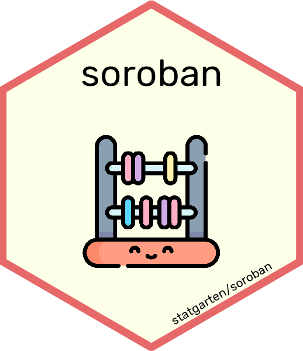

```{r, include = FALSE}
knitr::opts_chunk$set(
  collapse = TRUE,
  comment = "#>"
)
```

## Installation and use

* Install all the packages in the statgarten by running `remotes::install_github("statgarten/statgarten")`.

## Statgarten

The statgarten includes the packages for EASY-data analysis with shiny application (web).

As of statgarten 0.1.0, the following packages are included:


- `board` is package for Data Profiling


- `colorpen` is package for Data Visualize


- `door` is package for Data Analysis. (**Main package**)


- `scissor` is package for Data Transform



- `soroban` is package for Statistical Data Analysis


- `statgarten` is package for utilizing statgarten packages.

---

For any issue or suggestion, please make issue in [statgarten's github](https://github.com/statgarten/statgarten/issues).
