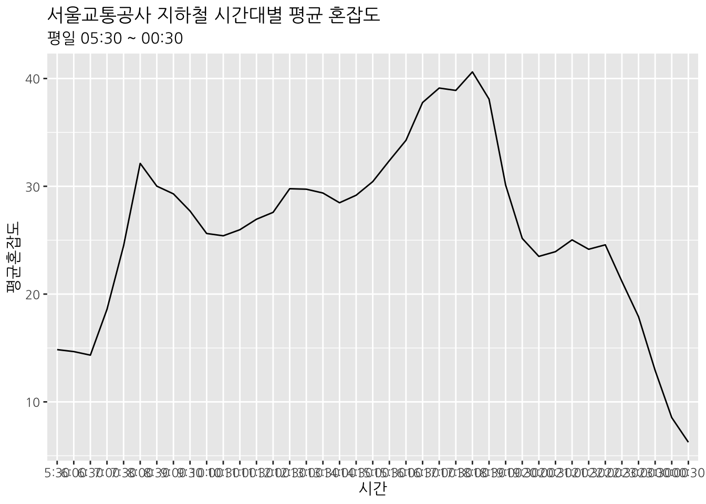
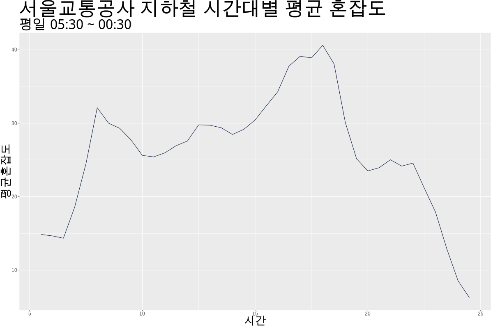
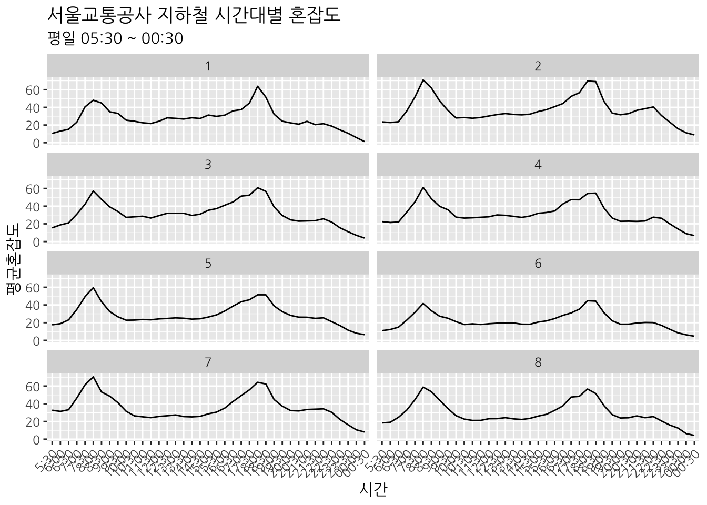
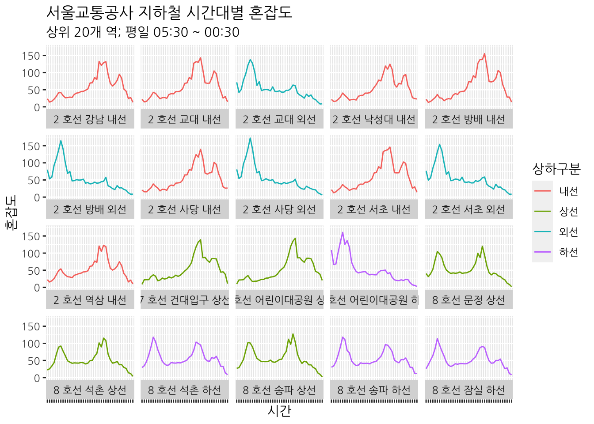
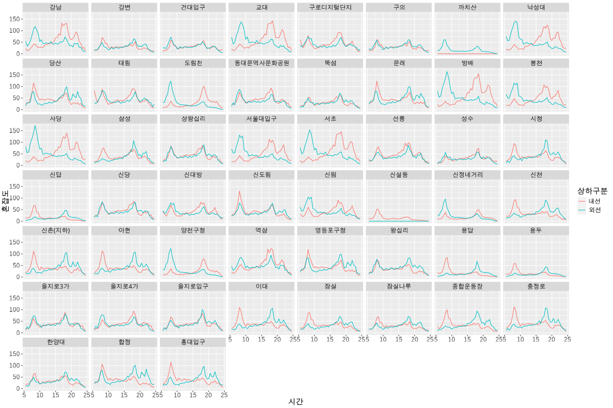

```{r, include = FALSE}
knitr::opts_chunk$set(
  collapse = TRUE,
  comment = "#>"
)
library(statgarten)
```

Reference: [link](https://www.statgarten.com/publicdata101/%ED%98%B8%EC%84%A0-%EC%A7%80%ED%95%98%EC%B2%A0-%ED%98%BC%EC%9E%A1%EB%8F%84-%EB%B6%84%EC%84%9D.html)

### 1: statgarten 기초 (datatoys to **linechart**)

<p align='center'>
  
  
</p>

<p align = 'center'>
  <iframe width="560" height="315" src="https://www.youtube.com/embed/_f2uLsMHbdc?si=MxXrBKyKxJEUR5be" title="YouTube video player" frameborder="0" allow="accelerometer; autoplay; clipboard-write; encrypted-media; gyroscope; picture-in-picture; web-share" allowfullscreen></iframe>
</p>

#### 다루는 내용

- datatoys를 활용한 데이터 준비
- 데이터 필터, 형태 변환 및 가공
- 요약 통계치 계산
- 데이터 시각화
- 시각화 커스텀 및 다운로드

### 2: datatoys to **Multiple linechart**

<p align='center'>
  
  
</p>

<p align = 'center'>
  <iframe width="560" height="315" src="https://www.youtube.com/embed/ZOL9ngRtRc8?si=73NgHcQ38qj0q6hB" title="YouTube video player" frameborder="0" allow="accelerometer; autoplay; clipboard-write; encrypted-media; gyroscope; picture-in-picture; web-share" allowfullscreen></iframe>
</p>

### 3: datatoys to **linechart with Facet**

<p align='center'>
  
  
</p>

Video WIP

### 4: datatoys to **linechart with Facet** (2)

<p align='center'>
  
  
</p>

Video WIP
