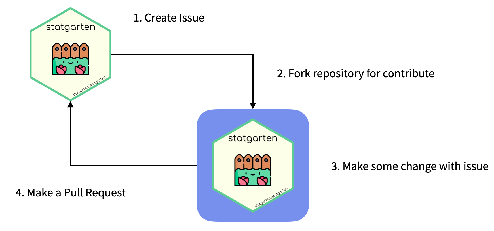

```{r setup, include=FALSE}
knitr::opts_chunk$set(echo = TRUE)
```

## Contribute to statgarten

-   statgarten aimed to help more people to utilize data freely, which includes building this statgarten system.

-   You can contribute regardless of your ability or situation. so don't be burdened.

-   Here are some examples for contributions. However, you are welcome to make suggestions in other ways as well.

- If you have any questions, create issue or mail me. (jinhwan@zarathu.com)

--- 

### For Users 😁

> Share your own usage (like data wrangling) examples

- Even statgarten provides public data, various analysis and insight can be generated by user. So, share your story and help other people to be inspired.

- **Until format is decided, you may submit any type of article**

> Ask (or Answer) a question

- Every questions are valuable to others, so please don't hesitate.

> Create issues

- This includes `bug report`, `feature request` or `other things`.

- Recommend to create each package's repository, or statgarten's repository (this [link](https://github.com/statgarten/statgarten/issues)!)

---

### For Developers 👩‍💻

> Contribute code or documentation 

To contribute this way, you may follow these steps.

1. Create `issue`

2. `Fork` statgarten 

3. `Make` some change 

4. Make a `pull request` 

Now you're contributor of statgarten 🎉



> Code Convention

- Commit

To explain your work well, we recommend to utilize commit message using this [commitlint](https://commitlint.io/#Conventional)

You may claify your work's 1. type and 2. imperative message 3. related issue (if exists.)

- R code 

Should styled via [styler package](https://github.com/r-lib/styler)


