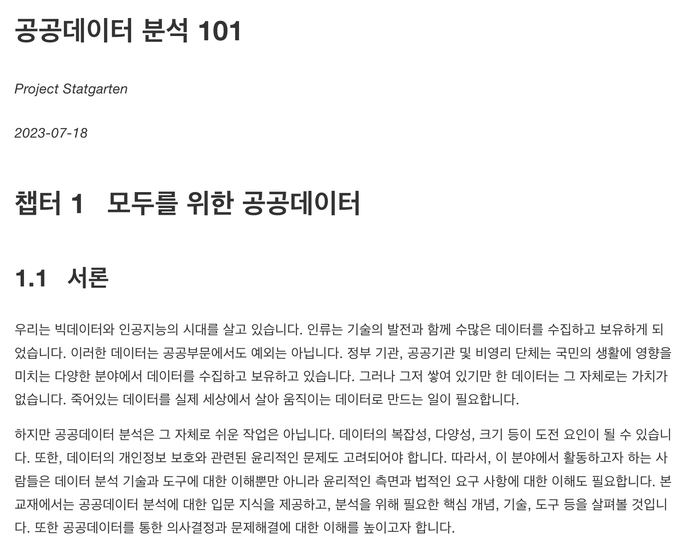

```{r, include = FALSE}
knitr::opts_chunk$set(
  collapse = TRUE,
  comment = "#>"
)
library(statgarten)
```

## statgarten 프로젝트란?

### 프로젝트 개요

지속적인 공공데이터 확대, 데이터 3법의 통과에 따라 데이터 경제가 급속하게 커지고 있으나, 여러가지 문제점으로 인해 데이터의 가공과 활용이 어려움. 

이를 해결하는 것에 도움을 주기 위해 아래 프로젝트들을 진행합니다.

- [데이터분석 모듈형 패키지](https://github.com/statgarten) 개발

<p align='center'>
  
</p>

- 생활 밀착형 공공데이터 예제데이터 패키지 [#1(R 용)](https://github.com/statgarten/datatoys) [#2(Python 용)](https://github.com/statgarten/datatoys-python) 개발

<p align='center'>
  
</p>

- [연구자용 공개SW 기반 웹애플리케이션](https://github.com/statgarten/jsmodule) 개발

<p align='center'>
  
</p>

- [eBook: 공공데이터 분석 101](https://www.statgarten.com/publicdata101/) 

<p align='center'>
  
</p>

- 활용 영상 제작 (예정)

---

### 프로젝트 목표

- 클라우드 서비스를 활용한 공개SW 기반의 통계 패키지 개발
- 지속가능한, 데이터 분석 패키지 (statgarten + openstat) 생태계

---

### 현재 개발된 패키지

> statgarten

- door (Main application)
- board (EDA)
- colorpen (Visualize)
- scissor (Wrangling)
- soroban (Statistics)
- stove (ML)
- playdoh (AI)
- dockerImage (docker version)

> References

- datatoys & datatoys-python (public data)
- maps (map data)
- public data 101 (ebook)

> System

- SGDG (design system)
- sgthemes (ggplot theme)

> Research

- jskm (survival analysis)
- jsmodule (analysis)
- jstable (tableone)

---

### 재정 지원

본 프로젝트는 2022 정보통신·방송 기술개발사업 및 표준개발지원사업의 지원 대상으로 선정되어 2022-2023년에 걸쳐 개발 진행 중입니다.

